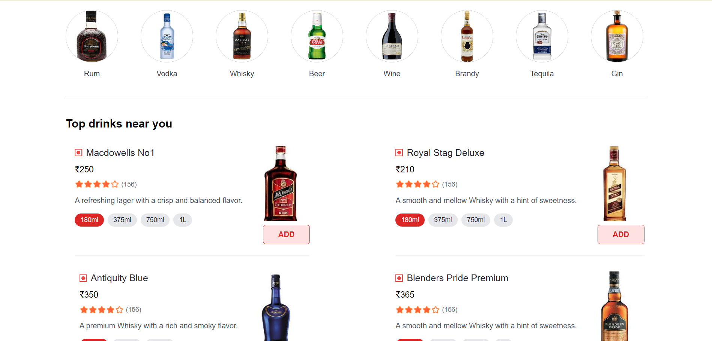
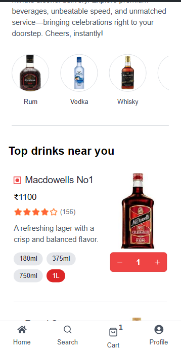
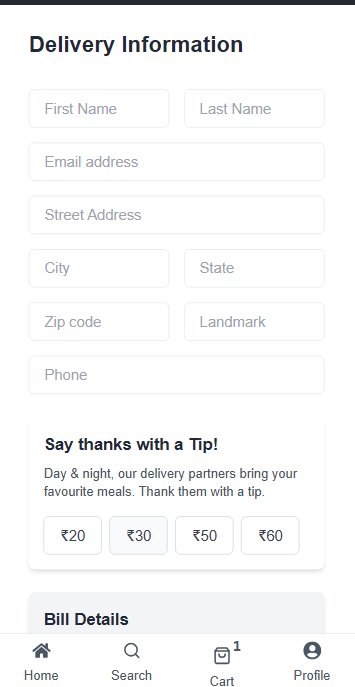
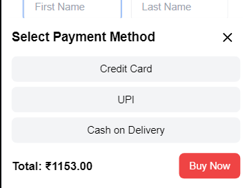
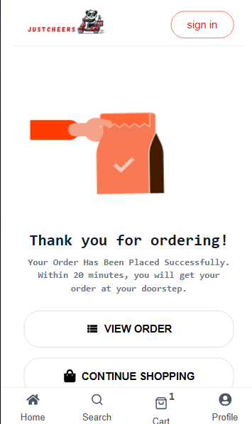

# Just Cheers 🍻

**An Alcohol Delivery App**  
Visit the Full stack : https://just-cheers.onrender.com/
 
Only Frontent : https://justcheers.netlify.app/
---

## Screenshots

### Homepage

### Top Drinks (LOGO)

### Top Drinks (Mobile View)

### Delivery Information Form

### Payment Methods (Desktop)

### Order Confirm (Mobile)

---

## Features

- Explore a variety of drinks by category (Rum, Vodka, Whisky, etc.)
- Intuitive and responsive UI for desktop and mobile
- Easy-to-use delivery form with tip customization
- Add items to the cart directly from product cards
- Multi-size selection for bottles (180ml, 375ml, 750ml, 1L)

---

## Tech Stack

- **Frontend**: React, Tailwind CSS
- **Backend**: Node.js, Express
- **Database**: MongoDB
- **Hosting**: Netlify for frontend, Render for backend

---

